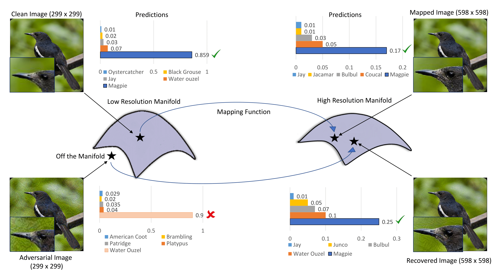

# Image Super-Resolution as a Defense Against Adversarial Attacks


This repository is an PyTorch implementation of the paper [Image Super-Resolution as a Defense Against Adversarial Attacks](https://arxiv.org/abs/1901.01677)

We use wavelet denoising and image super resolution as pre-processing steps to defend images against adversarial attacks. If you find our work useful in your research or publication, please cite our work:

We provide scripts for reproducing all the results from our paper. You can check the efficacy of our defense on your own adversarial images.

## Dependencies
* Python 3.6
* PyTorch >= 0.4.0
* **imageio**
* tqdm


## Clone the repository
Clone this repository into any place you want.
```bash
git clone https://github.com/aamir-mustafa/super-resolution-adversarial-defense
cd super-resolution-adversarial-defense
```
## Wavelet Denoising
You can test our wavelet denoising + super-resolution algorithm on your own adversarial images and their corresponding ground truth labels. 
 
``Wavelet_Denoising.py`` -- (change the path of adversarial images and ground truth labels).

* The denoised images will be saved in ``denoised_images_folder`` folder.


## Super Resolution
Place your denoised images in ``test`` folder. (like ``test/<your_image(s)>``) We support  **jpg** files.

Run the script in ``src`` folder.
```bash
cd src       # You are now in */super-resolution-adversarial-defense-master/src
sh super_resolution.sh
```

* You can find the result images from ```experiment/test/results-Demo``` folder.

## Accuracy Prediction

``Accuracy.py`` (Evaluate the performace of our method by comapring accuracies on adversarial and recovered images).

## Citation
```
@article{mustafa2019image,
  title={Image Super-Resolution as a Defense Against Adversarial Attacks},
  author={Mustafa, Aamir and Khan, Salman H and Hayat, Munawar and Shen, Jianbing and Shao, Ling},
  journal={arXiv preprint arXiv:1901.01677},
  year={2019}
}
```
